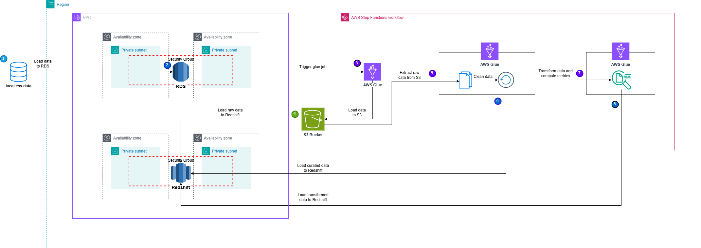

# Batch Data Processing for Rental Marketplace Analytics

## Overview

This ETL pipeline is designed to process batch data for a rental marketplace platform using AWS Glue and AWS Step Functions. The pipeline extracts data from AWS MySQL, validates and transforms it using AWS Glue (PySpark), and loads the processed data into Amazon Redshift for analytical reporting.

## Architecture Overview

### Components Used
- **AWS Aurora MySQL**: Stores rental marketplace application data.
- **AWS S3**: Serves as an intermediate storage layer for raw and processed data.
- **AWS Glue**: Handles ETL transformations using PySpark.
- **Amazon Redshift**: Stores transformed data for analytical queries.
- **AWS Step Functions**: Orchestrates the workflow efficiently.
- **AWS IAM Roles**: Ensures secure access control for Glue and Redshift.

### Pipeline Flow
1. **Data Extraction**: AWS Glue extracts data from MySQL and writes it to S3 in CSV format.
2. **Validation & Cleaning**: Ensures data integrity by handling missing values and duplicates.
3. **AWS Glue Processing**: Cleans and transforms raw data, computes business KPIs, and loads results into Amazon Redshift.
4. **Multi-Layer Redshift Architecture**: Data is organized into Raw, Curated, and Presentation layers for efficient analytical queries.

### **Architecture Diagram**  

## AWS Glue Job Implementation

### Key Transformations in PySpark
- Reads apartment listing, user interaction, and booking data from S3.
- Validates and cleans raw data.
- Applies transformations such as handling missing values, removing duplicates, and normalizing formats.
- Computes rental performance and user engagement KPIs using PySpark.
- Loads processed data into Amazon Redshift.

## Amazon Redshift Multi-Layer Architecture

Redshift is structured into three layers to optimize data processing and reporting:
1. **Raw Layer**: Stores unprocessed data loaded directly from S3.
2. **Curated Layer**: Contains cleaned and transformed data, removing duplicates and handling inconsistencies.
3. **Presentation Layer**: Stores aggregated and precomputed metrics for business intelligence and reporting.

## Orchestration using AWS Step Functions

- Step Functions define the ETL workflow for automation.
- AWS Glue jobs are executed in sequence, ensuring correct processing.
- Transitions between Redshift layers (Raw -> Curated -> Presentation) are automated via Step Functions.
- Error handling & retries are enabled for fault tolerance.

### Step Function Workflow
1. Extract Data from Aurora MySQL
2. Load Raw Data into Redshift
3. Transform Data in the Curated Layer
4. Generate Metrics in the Presentation Layer
5. Archive Processed Data

## Logging & Error Handling

- Detailed logging in AWS Glue and Step Functions for debugging.
- Data validation ensures integrity before processing.
- Retries enabled for AWS Glue jobs to handle failures.

## Conclusion

This ETL pipeline automates batch data ingestion and validation with AWS Glue, transforms rental marketplace data using PySpark, organizes data into Raw, Curated, and Presentation layers in Amazon Redshift, computes key KPIs, and enables structured analytical reporting. The workflow is orchestrated using AWS Step Functions, ensuring reliable and efficient execution.